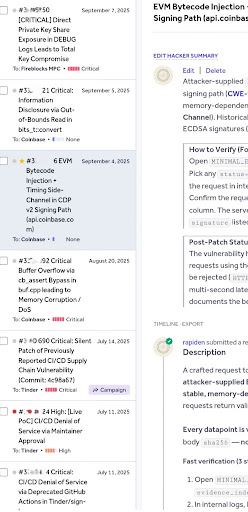

## Hi, I'm Nathaniel 

Independent developer focused on intelligent agents and advanced simulation.  
Currently working on visualizing and controlling complex environments.

## 📫 Contact

Feel free to reach out for collaborations, research inquiries, or project access.

<a href="mailto:rydbergphotonic1@proton.me">📩 Contact Nathaniel</a>

---

##  Featured Projects

- **Wave Digit** — [Interactive demo on Vercel](https://wavedigitdemo.vercel.app/)
- **QFVCS – Core Layer** — [Public repo](https://github.com/RAPIDENN/QFVCS) 
  Minimal, extendable foundation for fractal-based quantum computation & neural propagation.  
  ⚙ Includes Schrödinger dynamic core, BitNet logic, and visualization hooks.
- *(Private)* — [IA-AGENTS: Fractal technology & symbolic propagation] *(NDA Required)*
- **Enterprise Infrastructure** — *Performance & scalability*

- ## 🛡️ NDA Access Request

If you are interested in gaining access to proprietary or restricted projects, you must first submit an NDA (Non-Disclosure Agreement) request.

> ℹ️ Applications without GitHub verification will be automatically rejected.

---

## Research

I am actively engaged in responsible research on web infrastructure security, contributing to safer and more resilient systems.

---

<h2 align="center">🐍</h2>

  

---

## Support My Work

---

> *“He builds an architecture of all paths — and is lost within them all.”*

  

